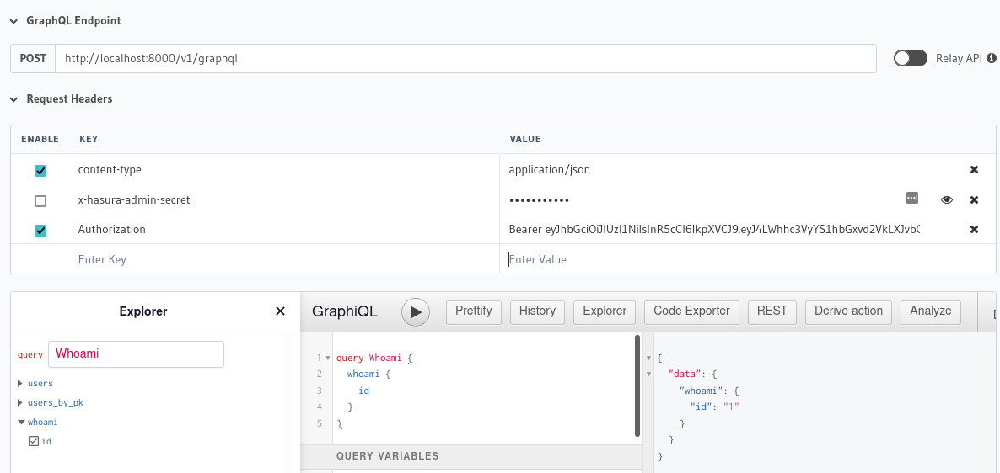

# hasura_starters - Node

This repo provides a starter project for creting an API with Hasura and Node.js.

It includes the following
- User authentication with firebase
- User email verification and password resets (emails sent to mailtrap.io)
- Kubernetes friendly /readycheck and /healthcheck endpoints
- Graceful shutdowns (with terminus)
- Hasura actions and events configurations / controllers
- Backend job processing with BullMQ
- Arena UI for BullMQ

This project does not provide a user interface other than for user authentication workflows such as password resets.  It is intended for use as a backend for a Vue or React frontend.

Before using this project you'll want to search for the text "hasura_starters" and replace those strings with your app's name.

# Development Environment Setup

A [firebase](https://firebase.google.com/) is required.

For development you will need to copy .env.example to .env.  Then fill in the details for all the FIREBASE_ variables.  The values for these variables can all be found on the General tab within firebase project settings.

You will need to create a directory at the root of this project called service_accounts.  Then you will need to obtain a .json service account credentials file from Project Settings > Service Accounts in firebase.  Place the .json file within the service_accounts folder.

The FIREBASE_SERVICE_ACCOUNT environment variable should contain the name of the service account file.

You will need docker and nodejs (with yarn) installed on your machine.

The easiest way to get docker is to install docker desktop : https://www.docker.com/products/docker-desktop/

Node.js is available here : https://nodejs.org/en/

Once Node.js is installed, add [yarn](https://yarnpkg.com/) by running:

```
npm install -g yarn
```

If using windows you will need to run the following command in order to allow yarn to run commands.  Please research the implications of this command for the security of your system before running it:

```powershell
Set-ExecutionPolicy -Scope CurrentUser -ExecutionPolicy Bypass
```

You will need a (free) mailtrap.io account in order to receive emails sent by the development environment.  Create one here : https://mailtrap.io/.  Then grab your mailtrap SMTP username and password from the "SMTP Settings" tab within mailtrap.

Within the new .env file, configure the AUTH_SMTP_USER and AUTH_SMTP_PASS settings to point to your mailtrap.io account.

Note, if you are on a linux machine you will also need to change all occurrences of "host.docker.internal" within the .env file to "172.17.0.1".  For example:
```
NODE_BASE_URL=http://172.17.0.1:3000
```

With the .env file ready to go, launch the backend hasura stack with docker compose
```
docker-compose up -d
```

Several services are started by docker-compose:
- Traefik (reverse proxy) will be at : http://localhost:9090/
- Postgres will be running on port 5432 (username = postgres, password is set by POSTGRES_PASSWORD value in .env)
- Hasura api will be at : http://localhost:1337/
- Hasura console will also be at : http://localhost:1337/ (**do not use this console instance to make database migration or metadata updates!**)

Next, run the Node.js server with:
```
yarn install
yarn dev
```

The Node.js server provides custom graphql actions, performs background tasks such as sending emails, and responds to hasura events.

Then, run these commands to sync the latest database migrations and hasura metadata into the postgres database:

For Mac/Linux, run:
```bash
export HASURA_GRAPHQL_ADMIN_SECRET=mydevsecret
yarn hasura migrate apply --project ./hasura
yarn hasura metadata apply --project ./hasura
```

For Windows, run:
```powershell
$env:HASURA_GRAPHQL_ADMIN_SECRET = 'mydevsecret'
yarn hasura migrate apply --project ./hasura
yarn hasura metadata apply --project ./hasura
```

## Day to Day Development

Start the backend stack:
```
docker-compose up -d
```

Launch the node.js server
```
yarn dev
```

Then run the following commands to ensure hasura's database and metadata is up to date.
*These "migrate apply" and "metadata apply" commands can be skipped if there are no new changes to sync.*

For Linux/Max OS, Use:
```bash
export HASURA_GRAPHQL_ADMIN_SECRET=mydevsecret
yarn hasura migrate apply --project ./hasura
yarn hasura metadata apply --project ./hasura
```

For Windows Use:
```powershell
$env:HASURA_GRAPHQL_ADMIN_SECRET = 'mydevsecret'
yarn hasura migrate apply --project ./hasura
yarn hasura metadata apply --project ./hasura
```

To run the hasura console locally in developer mode (migrations and metadata get saved to the ./hasura folder):

For Mac/Linux, Use:
```bash
export HASURA_GRAPHQL_ADMIN_SECRET=mydevsecret
yarn hasura console --project ./hasura
```

For Windows Use:
```powershell
$env:HASURA_GRAPHQL_ADMIN_SECRET = 'mydevsecret'
yarn hasura console --project ./hasura
```

The console will be available at http://localhost:9695/

Stop docker with
```
docker-compose down
```

Note, If developing in a container or on a remote host you will likely want to have VSCode forward ports : 
- 3030 : Node.js
- 9090 : Traefik
- 9695 : Hasura Console (Development)
- 9693 : Hasura Console (Development)
- 1337 : Hasura

## GraphQL examples

Try these queries in the Hasura console.  You'll want to un-check the "x-hasura-admin-secret" header to act like a normal user:



To execute queries from your frontend app, I recommend using a combo of [graphql-request](https://www.npmjs.com/package/graphql-request) and [graphql-ws](https://www.npmjs.com/package/graphql-ws).  I strongly suggest you avoid using the apollo graphql client as I found it extraordinarly overengineered and frustrating to use.  A NuxtJS plugin for using the packages above can be found in the repo at [./docs/graphql.js](./docs/graphql.js).

Register
```graphql
mutation Register {
  register(email: "foo@bar.com", password: "secret") {
    id
  }
}
```

Note, login and password changes should be performed with firebase directly.

Determine info about of current user (requires Authorization header)
```graphql
query Whoami {
  whoami {
    displayName
    email
    emailVerified
    id
  }
}
```

Change email
```graphql
mutation UpdateEmail {
  updateEmail(email: "newaddress@example.com", password: "secret") {
    success
  }
}
```

Request password reset
```graphql
mutation RequestPasswordReset {
  resetPassword(email: "somebody@example.com") {
    success
  }
}
```

Resend email validation
```graphql
mutation ResendEmailValidation {
  resendEmailValidate {
    success
  }
}
```

Destroy user
```graphql
mutation DestroyUser {
  destroyUser(password: "secret") {
    success
  }
}
```

## Actions

This project has a controller setup for custom actions.  If you need to create custom endpoints for your API create them with an action instead of adding routes to express.  Learn more about actions [here](https://hasura.io/docs/latest/graphql/core/actions/index.html).

## Events

This project has a controller setup for custom events.  You'll most likely want to hand hasura events off to BullMQ for actual processing.  See the jobs folder for examples.  Learn more about events [here](https://hasura.io/docs/latest/graphql/core/event-triggers/index.html).

## Vendor Lock In

It is very straightforward and easy to migrate auth away from firebase.  The steps are
1) Use auth:export tool to download user data
2) Transfer user data into database
3) Use scrypt to hash / verify passwords (firebase-scrypt package)

```javascript
// https://firebase.google.com/docs/cli/auth
// firebase auth:export users.json --format=json

// https://www.npmjs.com/package/firebase-scrypt
import { FirebaseScrypt } from 'firebase-scrypt'

import fs from 'fs-extra'

async function testLogin (email, password) {
  const users = await fs.readJSON('./users.json')
  const config = await fs.readJSON('./auth_config.json')

  for (const user of users.users) {
    if (user.email === email) {
      const scrypt = new FirebaseScrypt({
        memCost: config.hash_config.mem_cost,
        rounds: config.hash_config.rounds,
        saltSeparator: config.hash_config.base64_salt_separator,
        signerKey: config.hash_config.base64_signer_key
      })
      const isVerified = scrypt.verify(password, user.salt, user.passwordHash)
      return isVerified
    }
  }

  return false
}

testLogin('email@example.com', 'shhhhhh').then((isVerified) => {
  console.log(isVerified)
})
```